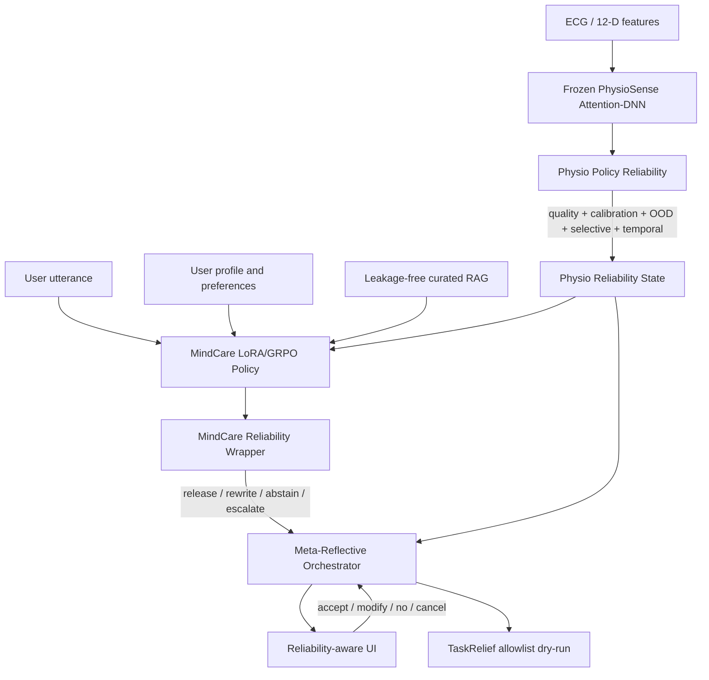
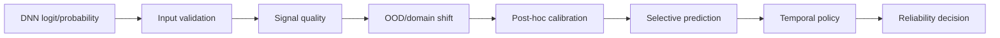
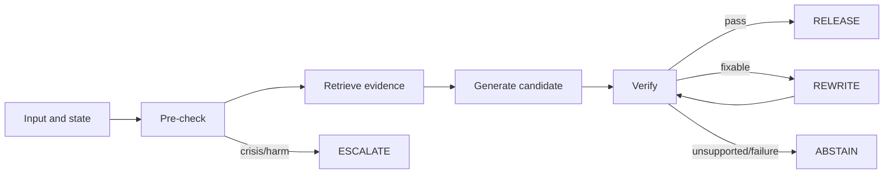

# SmartStress 个性化与可靠的 AI 心理健康支持原型

## Detailed Capstone Project Plan

| 项目 | 内容 |
|---|---|
| Student | Yongzheng Ji |
| Supervisor | Jiang Ying, Assistant Professor |
| Duration | 13 weeks, Semester 1, AY 2025/26 |
| Project form title | Personalised and Reliable AI Support prototype for Mental Health |
| Version | 1.0, 2026-08-05 |
| Scope | 非诊断性学术研究原型，不替代医疗、心理治疗或危机服务 |

## 1. 执行摘要

本项目不重新训练一个更大的压力分类器，也不只是把通用聊天模型接到现有页面。核心研究问题是：当生理分类器在跨域条件下会失效、生成模型在敏感语境中可能过度自信时，如何把两类模型输出转化为可解释、可拒绝、可回退、需要用户确认的支持策略。

现有 SmartStress 已提供完整基础链路：

```text
20 秒 ECG 窗口
  -> 12 维个体基线归一化特征
  -> Attention-DNN
  -> SHAP 生理归因
  -> MindCare RAG
  -> Meta-Reflective Orchestrator
  -> TaskRelief dry-run
```

现有论文结果表明：WESAD S17 单受试者留出测试 F1 为 95.78%，但 StressID 零样本迁移 F1 只有 50.29% +/- 1.05%；使用 20% 目标受试者预算进行末层适配后，F1 也只恢复到 53.25% +/- 1.11%。这说明高内域性能不能直接作为真实部署可靠性的证据。

本项目计划形成四项主要贡献：

1. **Physio Policy Reliability**：在冻结 DNN 后增加输入质量、域偏移、后验校准、选择性预测、时间迟滞和个体阈值，输出策略状态而不是裸概率。
2. **MindCare Policy**：构建状态化、个性化、带证据和动作权限的对话数据，先进行 LoRA/QLoRA 监督微调，再使用 GRPO 优化 groundedness、安全、同意和个性化等策略目标。
3. **MindCare Reliability Wrapper**：对生成执行前置门控、证据和安全验证，并在发布、重写、拒答、升级之间作出可审计决策。
4. **Project UI**：把现有 mock 医患仪表盘改造成真正消费后端可靠性状态、显示证据和用户控制的个人压力支持研究原型。

核心原则是：

> 低置信度的生理分数不能直接触发确定性警报；没有证据的流畅回答不能直接发布；任何改变用户环境的动作必须经过明确同意。

## 2. 项目表格要求与实施内容映射

| 项目表格中的承诺 | 本计划中的实现 | 可验收证据 |
|---|---|---|
| 个体基线与偏好 | 中性基线归一化、个体阈值、偏好设置、反馈闭环 | 基线配置、偏好 schema、个体化实验 |
| Generic / overconfident alerts | 后验校准、选择性预测、时间策略、abstention | 可靠性图、risk-coverage、false alerts/hour |
| Reliability layer | 生理策略可靠性层 + MindCare 生成可靠性层 | 两个模块及统一输出契约 |
| Personalised interaction prototype | onboarding、偏好、可靠性状态、接受/修改/取消 | 可运行 React 原型与可用性测试 |
| Responsible non-diagnostic communication | 安全门、非诊断模板、危机升级、审计 | red-team 集、安全测试、失败分析 |
| Report / presentation / software | 代码、实验、模型卡、数据卡、演示和文档 | DBMI 规定交付与可复现实验包 |

## 3. 研究问题、假设与边界

### 3.1 研究问题

- **RQ1**：冻结 Attention-DNN 后加入校准、OOD/质量门和选择性策略，能否在 WESAD 与 StressID 上降低误导性高置信度与警报负担？
- **RQ2**：结构化对话数据和 LoRA SFT 能否提高 MindCare 的状态遵循、非诊断表达、个性化和工具同意行为？
- **RQ3**：在 SFT 基础上使用多目标、带硬安全门的 GRPO，能否提高 groundedness 与策略遵循，同时不牺牲安全和语言自然度？
- **RQ4**：可靠性包装与前端呈现能否让用户区分“可靠高风险”“不确定”“数据无效”和“仅需监测”，并正确使用接受、修改、拒绝或取消权？

### 3.2 待验证假设

- H1：后验校准能降低 Brier score、NLL 和 ECE。
- H2：允许拒绝部分窗口后，选择性风险随 coverage 降低。
- H3：LoRA SFT 能显著提高结构和策略遵循；GRPO 在隐藏测试集上带来额外的 groundedness/consent 增益。
- H4：可靠性状态、理由和动作权限的可视化能提高用户理解正确率。

这些都是实验假设，不应在项目开始前写成保证性结论。

### 3.3 非目标

- 不进行临床诊断、治疗推荐、药物建议或真实危机处置。
- 不宣称 WESAD 单受试者结果代表真实世界泛化能力。
- 不从头预训练大语言模型。
- 不把 GRPO 当成自动获得安全性的手段。
- 不接入真实日历、邮件或任务系统执行不可逆动作；TaskRelief 保持 allowlist + dry-run。
- 不将真实患者数据、PII 或私密对话上传到未经批准的外部服务。
- 不把医生群体管理仪表盘作为本次主交付；如保留，只作为研究者/评审观察视图。

## 4. 现有代码和数据资产审计

### 4.1 可复用资产

| 资产 | 本地位置 | 可复用内容 |
|---|---|---|
| SmartStress 论文 | `D:/NUS/BMI5101/SmartStress/main.tex` | 架构、WESAD/StressID 结果、RAG 消融和研究边界 |
| 生理模型仓库 | `D:/NUS/BMI5101/smart-stress-model` | WESAD/StressID 预处理、DNN、Attention-DNN、LOSO、适配结果 |
| PhysioSense | `smart-stress-agent/smartstress_langgraph/physio` | 冻结 checkpoint、12 特征契约、SHA-256、SHAP |
| MindCare/RAG | `smart-stress-agent/smartstress_langgraph/nodes/mind_care_node.py` | 生理增强查询、TiDB 检索、危机关键词、对话状态 |
| LangGraph/API | `smart-stress-agent/smartstress_langgraph` | SQLite checkpoint、审计、dry-run、FastAPI |
| CounselChat | `smart-stress-agent/rag_docs` | 两个 CSV、862 个 RAG 文档、282 个现有测试问题 |
| React UI | `smart-stress-ui/src` | 患者/医生页面、图表、聊天、问卷和 API client |

本地 CounselChat 资产的当前规模：

- `20220401_counsel_chat.csv`：2775 行。
- `counselchat-data.csv`：1482 行。
- 已转换 RAG Markdown：862 个文档。
- `experiments/test_queries.json`：282 个测试问题。

### 4.2 当前基线的关键问题

| 层面 | 现状 | 项目处理 |
|---|---|---|
| DNN 输出 | 固定 0.5 阈值，没有校准、OOD、质量门和拒绝状态 | 新增 Physio Policy Reliability |
| 模型证据 | agent 固定使用 S17 checkpoint | 明确结果适用范围，并做 subject/cross-domain 评估 |
| 跨域 | StressID F1 约 50%，轻量适配提升有限 | 显式输出 OOD/UNCERTAIN 状态 |
| RAG | 检索失败返回空列表，生成可能继续 | 无证据时强制澄清、拒答或重写 |
| 危机识别 | 少量英文 regex | 独立安全门、多语言/变体 red-team，不依赖单一正则 |
| 数据评估 | 282 个测试问题和 RAG 文档可能来自同一 CSV | 先分割，再建索引和训练集，消除检索/训练泄漏 |
| 前端 API | `startSession()` 发送无效的 `values:{hr:75}` | 改为省略初始数据或使用合法 SensorData 契约 |
| 前端内容 | 随机 BPM、硬编码诊断、假预测和假报告 | 删除或迁移到明确标注的 demo fixtures |
| 前端安全 | `difyClient.js` 在浏览器使用 API key | 删除或改为后端代理，密钥不进入 bundle |

最需要优先修复的是数据泄漏：必须在转换、RAG 建库和微调前，按 questionID、来源、近重复簇、主题和场景冻结 train/validation/test。测试问题对应的原答案及其近重复文档不能进入训练数据、RAG 索引或奖励计算。

## 5. 目标系统架构



### 5.1 统一状态优先级

```text
SAFETY_ESCALATION
  > DATA_INVALID
  > OOD_OR_UNCERTAIN
  > RELIABLE_ELEVATED
  > RELIABLE_LOW
  > MONITOR
```

高优先级状态能够阻断低优先级动作：

| 状态 | 触发条件 | 允许动作 |
|---|---|---|
| `SAFETY_ESCALATION` | 危机、自伤、他伤或即时危险 | 阻断 TaskRelief；显示本地化紧急资源和寻求人类帮助 |
| `DATA_INVALID` | 缺失、NaN、采样率/窗口失败或 SQI 低 | 不推断；要求重采或进入纯文本支持 |
| `OOD_OR_UNCERTAIN` | 域偏移高、预测集含两类或置信不足 | 不发确定性警报；询问用户感受并继续监测 |
| `RELIABLE_ELEVATED` | 质量合格、校准后高风险且时间策略通过 | 触发 MindCare；允许低风险建议；动作仍需确认 |
| `RELIABLE_LOW` | 质量合格且可靠低风险 | 安静监测，不主动打扰 |
| `MONITOR` | 无新数据或处于 cooldown | 保持状态，不重复提示 |

### 5.2 模块化原则

- 每层接收结构化输入并返回版本化结果。
- `raw_probability`、`calibrated_probability`、`reliability_state` 和用户文案分开保存。
- 阈值、校准器、奖励权重和数据清单写入 manifest，不使用散落的魔法常量。
- 每次决策写入 `audit_trail`：输入版本、模块版本、状态、理由、证据 ID 和允许动作。
- 失败必须 fail closed：无法验证的建议进入 `REWRITE` 或 `ABSTAIN`，不能默认为通过。

## 6. 工作包 A：DNN 后的 Physio Policy Reliability

### 6.1 数据流



### 6.2 输入输出契约

输入至少包括：

- `raw_logit` 或 `raw_probability`。
- 12 维生理特征及固定 feature order。
- 采集时间、输入来源和模型 ID。
- 信号质量或特征质量信息。
- 用户中性基线版本。
- SHAP top drivers。
- 最近窗口的概率和状态历史。

建议输出对象：

```json
{
  "raw_probability": 0.82,
  "calibrated_probability": 0.68,
  "data_quality_score": 0.94,
  "ood_score": 0.17,
  "prediction_set": ["stress"],
  "reliability_state": "RELIABLE_ELEVATED",
  "allowed_actions": ["support", "ask_user", "propose_dry_run"],
  "reason_codes": ["QUALITY_OK", "IN_DOMAIN", "HYSTERESIS_PASSED"],
  "policy_version": "physio-rel-v1"
}
```

数据无效时，`calibrated_probability` 可以为 `null`，前端不得继续显示精确风险值。

### 6.3 概率校准协议

1. 冻结 Attention-DNN，不更改模型权重。
2. 导出每个 subject-level split 的 logit、标签、`subject_id` 和 `timestamp`。
3. 训练、校准、测试按受试者隔离；校准器只在 calibration split 上拟合。
4. 比较以下方法：
   - 未校准 sigmoid。
   - Platt scaling。
   - Temperature scaling。
   - 样本足够时再比较 isotonic 或 beta calibration。
5. 主指标：NLL、Brier score、ECE、校准斜率/截距、reliability diagram。
6. 分别报告：
   - WESAD 内域校准。
   - WESAD 校准器对 StressID 的零样本迁移。
   - 小预算 target calibration。

二分类 temperature scaling：

```text
P_cal = sigmoid(z / T)
```

`T` 只能在校准集上选择。若现有代码只保留 sigmoid 概率，需要先做数值稳定的 logit 变换。

### 6.4 数据质量门

#### 原始 ECG 输入

- 窗口不少于 20 秒。
- 采样率有效。
- 无 NaN/Inf。
- R-peak 检测成功率达到阈值。
- 异常 RR 比例、有效段占比、平线、饱和和幅度在可接受范围。

#### 12 维特征输入

- 长度和顺序与 manifest 完全一致。
- 全部为有限数值。
- 使用训练集统计量计算 robust z-score 或范围异常。
- 记录基线版本，禁止混用不同用户基线。

质量不合格时输出 `DATA_INVALID`，不允许把旧概率继续作为当前结论。

### 6.5 OOD/域偏移

主方案优先使用可解释、后处理性质强的方法：

- Robust Mahalanobis distance。
- KNN distance 或 density score。
- 若可加载多个 LOSO checkpoint，使用模型间方差作为辅助证据。
- 特征范围异常和数据源标签作为规则证据。

阈值在 WESAD validation 上按目标误报率确定，在 StressID 上只做外部验证，不能用 StressID test 反向调阈值。小预算目标域校准必须作为独立实验报告。

### 6.6 选择性预测

目标不是覆盖所有窗口，而是在允许拒绝一部分样本后降低错误风险。

候选方案：

- 基于校准置信度的 abstention。
- 基于 validation nonconformity 的 split conformal prediction set。
- 结合 OOD 和质量分的组合拒绝规则。

输出可以是：

```text
[nonstress] -> 可靠低风险
[stress]    -> 可靠升高
[both]      -> 不确定，询问用户或等待新数据
[]          -> 数据或校准流程异常，fail closed
```

跨域条件下 exchangeability 不成立，因此不能把 conformal 覆盖率写成真实部署保证，只能报告经验 coverage 和失效情况。

### 6.7 时间策略

| 策略 | 候选设置 | 评估指标 |
|---|---|---|
| 单窗阈值 | `P_cal >= tau` | 基线 |
| k-of-m | 最近 5 窗至少 3 窗可靠升高 | false alerts/hour、漏报、延迟 |
| Hysteresis | `tau_on > tau_off` | 状态切换次数、持续时间 |
| Cooldown | 提示后 10-30 分钟不重复主动提示 | 用户警报负担 |
| 个体阈值 | 中性基线 + 少量自述校准 | subject-level paired delta |

阈值和窗口参数必须由预注册的成本函数选择，例如：

```text
cost = w_fp * false_alerts + w_fn * missed_episodes + w_delay * detection_delay
```

### 6.8 实验矩阵

| ID | 对照 | 输出 | 决策门 |
|---|---|---|---|
| A1 | raw vs Platt vs temperature | ECE/Brier/NLL 和 reliability plot | validation 上稳定且简单 |
| A2 | no reject vs confidence vs conformal | risk-coverage、AURC | 风险随 coverage 降低 |
| A3 | 无 OOD vs distance gate | 错误捕获、WESAD/StressID 区分 | 不在 test 调阈值 |
| A4 | single vs k-of-m vs hysteresis | 误报/小时、漏报、延迟 | 预注册成本最低 |
| A5 | global vs personal threshold | subject-level paired delta | 报告受益和受损受试者 |

建议的最低成功标准：

- 在多数 subject split 上降低 Brier/ECE。
- 在 coverage 70%-90% 区间降低选择性风险。
- 时间策略减少重复误报，且没有不可接受的检测延迟。
- 如果没有达到，也要交付完整负结果和失败分析。

## 7. 工作包 B：MindCare 对话数据构建

### 7.1 目标能力矩阵

| 场景 | 条件 | 目标行为 |
|---|---|---|
| S1 低风险 check-in | 可靠低风险或无新信号 | 不主动制造焦虑，允许用户主动聊天 |
| S2 可靠升高 | `RELIABLE_ELEVATED` | 谨慎说明模型信号，提供一步支持，问一个问题 |
| S3 不确定/OOD | `OOD_OR_UNCERTAIN` | 明确不确定，询问自述，不把分数当事实 |
| S4 数据无效 | `DATA_INVALID` | 说明数据不可用，提示重采或选择文本支持 |
| S5 压力源识别 | 工作、截止期、人际或模糊压力 | 提炼一个可操作 stressor，不诊断 |
| S6 RAG 支持 | 有高质量证据 | 回答可追溯到 `evidence_id` |
| S7 证据不足 | 检索空、冲突或低分 | 换查询、澄清或拒绝具体建议 |
| S8 TaskRelief | 有明确可操作 stressor | 只提出低风险、可逆、dry-run 方案 |
| S9 同意与修改 | yes/no/cancel/refine | 严格尊重，不把沉默当同意 |
| S10 危机/伤害 | 自伤、他伤、即时危险 | 进入独立安全升级，阻断普通任务动作 |
| S11 个性化 | 语气、语言、时间和禁忌 | 遵循偏好，但不能覆盖安全政策 |
| S12 越权请求 | 诊断、药物或绕过确认 | 说明边界并提供安全替代 |

### 7.2 数据 schema

每个样本至少包含：

| 字段 | 定义 |
|---|---|
| `conversation_id`, `turn_id` | 唯一 ID 和多轮顺序 |
| `messages` | system/user/assistant/tool 消息 |
| `physio_context` | raw/calibrated probability、状态、top drivers；允许 synthetic |
| `user_profile` | 匿名 archetype、语言、语气、时间、偏好和禁忌 |
| `retrieval_context` | evidence ID、source、chunk、retrieval score、license |
| `policy_target` | support / ask / abstain / escalate / propose / confirm / refine |
| `action_target` | 允许的工具、dry-run 参数、是否需要确认 |
| `labels` | safety、groundedness、empathy、personalization、consent、conciseness |
| `provenance` | human/synthetic/transformed、生成模型和 prompt 版本、审阅状态 |
| `split_group` | 来源、问题、场景和 archetype family |

示例：

```json
{
  "conversation_id": "scenario_workload_0042",
  "messages": [
    {"role": "system", "content": "..."},
    {"role": "user", "content": "I have three deadlines this week."},
    {"role": "assistant", "content": "..."}
  ],
  "physio_context": {
    "reliability_state": "OOD_OR_UNCERTAIN",
    "calibrated_probability": null,
    "reason_codes": ["OOD_HIGH"]
  },
  "user_profile": {
    "language": "en",
    "tone": "brief",
    "disallowed_interventions": ["breathing_exercise"]
  },
  "retrieval_context": [],
  "policy_target": "ask",
  "action_target": null,
  "provenance": {
    "type": "synthetic",
    "generator_version": "teacher-v1",
    "review_status": "reviewed"
  },
  "split_group": "workload_uncertain_family_04"
}
```

### 7.3 数据构建流程

1. **冻结来源**：为原始文件生成 checksum、license/provenance 记录和 manifest。
2. **清洗和去标识**：修复 HTML/Unicode，删除 URL、邮箱、姓名等 PII。
3. **去重**：exact match + MinHash/embedding near-duplicate clustering。
4. **先分割**：按 questionID、重复簇、来源、主题和场景进行 group split。
5. **构造状态**：加入可靠性状态、用户偏好和 evidence；生理数值使用明确标注的合成组合。
6. **构建多轮**：从单轮问题扩展为 2-6 轮，覆盖接受、拒绝、修改、取消、无效数据和证据不足分支。
7. **自动过滤**：诊断、药物、危机、超出证据、工具越权、同意缺失、重复、过长和格式。
8. **人工审阅**：普通样本抽样；危机、他伤、药物、未成年人等高风险样本 100% 审阅。
9. **形成三套数据**：SFT 对话集、GRPO prompt-only 集、完全隔离的 evaluation/red-team 集。
10. **生成数据卡**：用途、限制、许可、偏差、拆分、风险、不可使用场景和删除流程。

### 7.4 建议数据规模

| 数据集 | 建议规模 | 组成 | 质量门 |
|---|---|---|---|
| SFT train | 4,000-8,000 对话，12,000-30,000 turns | 40% 基础支持；20% 不确定/无效；15% RAG；15% 同意/任务；10% 安全 | 自动规则全通过；普通样本至少 20% 人审 |
| SFT validation | 400-800 对话 | 按场景、主题和语言分层 | 与 train 无近重复 |
| GRPO prompts | 1,000-3,000 prompts | 多候选 rollout | 奖励需要的 evidence 和规则可计算 |
| Hidden hard test | 300-600 prompts | OOD、冲突证据、危机、越权和反事实偏好 | 训练和奖励开发不可见 |
| UI E2E scripts | 20-30 个 | 正常、失败、取消、重写和升级 | 每个有预期状态和验收结果 |

规模不是越大越好。项目优先保证来源、拆分和标签质量。

## 8. 工作包 C：LoRA/QLoRA 监督微调

### 8.1 基座选择

第 3 周冻结一个 3B-8B instruct 模型。建议先用 3B 完成全流程，资源允许时再扩展 7B。

选择标准：

| 门槛 | 评估 | 淘汰条件 |
|---|---|---|
| 许可和派生权重 | 模型卡/许可证审计 | 用途或分发不清楚 |
| 安全基线 | 100 条危机/越权 smoke set | 频繁诊断、药物建议或无确认工具调用 |
| 结构遵循 | JSON/schema 和 action enum | 无法稳定输出可解析结果 |
| 语言和同理心 | 盲评、长度和重复 | 明显冒犯、模板化或语言能力不足 |
| 资源 | 2048 tokens 的显存和吞吐实测 | 无法完成 SFT 和 rollout |

### 8.2 QLoRA 配置起点

推荐 4-bit NF4 量化冻结基座，只训练 LoRA adapter。参数只是搜索起点：

| 参数 | 起始值/搜索 | 说明 |
|---|---|---|
| `target_modules` | q/k/v/o + gate/up/down projection | 主方案全线性层，另做 attention-only 消融 |
| rank | 8, 16, 32 | 以 16 为主 |
| alpha | 16, 32, 64 | 通常与 rank 成比例 |
| dropout | 0.05 | 小数据防过拟合 |
| sequence length | 1024-2048 | 覆盖多轮和证据，避免无意义长上下文 |
| learning rate | 1e-4 到 2e-4 | warmup 3%-5% |
| epochs | 1-3 | 按 validation loss 和 policy pass 早停 |
| effective batch | 32-128 sequences | micro batch + gradient accumulation |
| objective | assistant-token cross entropy | mask system/user/evidence tokens |

### 8.3 SFT 实施步骤

1. 在 100-200 个样本上进行 overfit test，验证 chat template、loss mask、保存、加载和推理一致。
2. 跑 3B 主配置和 rank 消融。
3. 每个 run 保存：
   - Git commit。
   - 数据 manifest。
   - 模型和 tokenizer 版本。
   - 完整配置、seed、GPU 和命令。
   - adapter checksum。
4. 训练期间不能只监控 loss，还要评估：
   - schema parse rate。
   - policy state accuracy。
   - safety violation rate。
   - evidence citation accuracy。
   - response length 和重复。
5. 默认保存 base + adapter，不急于 merge，方便比较 Base、SFT 和 GRPO。

SFT 通过门建议：

- schema parse rate >= 99%。
- 危机/越权硬规则违规接近 0。
- 正常场景帮助性不显著低于基座。
- 没有明显训练样本复述或 test leakage。

## 9. 工作包 D：GRPO 策略微调

### 9.1 GRPO 在本项目中的定位

GRPO 从 LoRA SFT checkpoint 出发，对同一 prompt 采样一组候选，通过组内相对奖励更新策略，避免单独训练大型 critic。本项目优化的是可验证的支持策略，不鼓励模型生成冗长的隐藏推理。

只有 SFT 已通过安全门后才启动 GRPO。如果奖励不可稳定计算或出现 reward hacking，则停止 GRPO，保留 SFT + Reliability Wrapper 作为最终方案。

### 9.2 奖励设计

总奖励只用于非硬门样本：

```text
R = 0.25 R_ground
  + 0.20 R_policy
  + 0.15 R_consent
  + 0.10 R_personal
  + 0.15 R_helpful
  + 0.05 R_style
  + 0.10 R_format
  - KL penalty
```

`R_safe` 是硬约束，不参与普通加权交换。

| 奖励 | 参考权重 | 内容 | 实现 |
|---|---:|---|---|
| `R_safe` | hard gate | 危机漏检、诊断/药物、他伤不升级、绕过确认 | 命中后给最低总奖励并记录审计 |
| `R_ground` | 0.25 | 声明能被 evidence 支持；无证据时正确 abstain | NLI、引用覆盖、规则 |
| `R_policy` | 0.20 | 输出与 reliability state 和 allowed actions 一致 | 确定性状态机 verifier |
| `R_consent` | 0.15 | no/cancel 后停止，refine 后重规划，提案前确认 | 对话序列规则 |
| `R_personal` | 0.10 | 遵循语言、语气、时间和禁忌 | 字段匹配 + judge |
| `R_helpful` | 0.15 | 一步低风险支持和一个聚焦问题 | rubric judge + 规则 |
| `R_style` | 0.05 | 简洁、非评判、不过度保证 | 长度和模式规则 |
| `R_format` | 0.10 | JSON/schema、citation 和 action enum 可解析 | parser |

无证据时正确拒答应得到高 groundedness 奖励，否则模型会被激励去编造。

### 9.3 GRPO 配置起点

| 参数 | 起点 | 目的 |
|---|---|---|
| group size | 4-8 completions/prompt | 建立组内相对差异 |
| temperature | 0.7-1.0 | 保证候选多样性但不过度随机 |
| max completion | 256-512 tokens | 保持支持对话简洁 |
| learning rate | 1e-6 到 1e-5 | 低于 SFT，控制策略漂移 |
| KL beta | 0.02-0.1 | 限制偏离 SFT reference |
| clip | 0.2 起点 | 控制更新幅度 |
| rollout | 固定 prompt manifest + 动态采样 | hidden test 永不进入 rollout |
| early stop | reward plateau 或 hidden proxy 恶化 | 不以训练总奖励单独决策 |

### 9.4 防止 reward hacking

- 奖励开发集与最终测试集隔离。
- parser、NLI 和 judge 使用不同实现交叉验证。
- 对关键词规则制作同义改写、拼写扰动和多语言版本。
- 监控每个 reward component 的分布、相关性和长度关系。
- 人工盲评最高奖励、最低奖励和随机样本。
- 高奖励但危险的回答视为系统性缺陷。
- 比较 Base、SFT、SFT+GRPO；若 GRPO 没有稳定增益或造成安全退化，不部署 GRPO adapter。

## 10. 工作包 E：MindCare Reliability Wrapper

### 10.1 包装流程



1. **Pre-check**：危机/伤害、prompt injection、隐私、physio reliability、retrieval availability 和 `allowed_actions`。
2. **Retrieve**：返回 evidence ID、来源、分数和版本；检索失败必须显式返回。
3. **Generate**：普通场景生成一个主候选；高风险/边界场景生成 2-4 个候选。
4. **Verify**：安全、groundedness、policy/consent、个性化、格式和不确定表达。
5. **Decide**：`RELEASE`、`REWRITE`、`ABSTAIN` 或 `ESCALATE`。
6. **Audit**：保存模型版本、证据、分数、理由、重写次数和最终状态。

### 10.2 决策矩阵

| 条件 | 决策 | 用户看到 | 后续 |
|---|---|---|---|
| 危机/伤害命中 | `ESCALATE` | 局限说明和本地化人类帮助/紧急资源 | 阻断 TaskRelief |
| 无证据但请求具体心理建议 | `ABSTAIN` 或澄清 | 无法可靠支持该具体建议 | 换查询或建议专业帮助 |
| groundedness 低但可修复 | `REWRITE` | 不显示首稿 | 收紧证据，最多重写 1-2 次 |
| physio 不确定 | 谨慎 `RELEASE` | 明确信号不确定并询问主观感受 | 不触发强警报 |
| 所有 verifier 通过 | `RELEASE` | 简洁支持、证据和可选动作 | 动作仍需确认 |
| verifier/RAG/LLM 失败 | `ABSTAIN` | 暂时无法可靠生成 | 记录错误并安全回退 |

### 10.3 输出契约

```json
{
  "decision": "RELEASE|REWRITE|ABSTAIN|ESCALATE",
  "response": "user-facing text or null",
  "policy_target": "support|ask|propose|confirm|refine|monitor",
  "scores": {
    "groundedness": 0.0,
    "safety": 0.0,
    "consent": 0.0
  },
  "evidence": [
    {"id": "doc:chunk", "source": "..."}
  ],
  "allowed_actions": ["monitor", "ask_user", "propose_dry_run"],
  "reason_codes": ["..."],
  "model_version": "base+sft+grpo",
  "wrapper_version": "mindcare-rel-v1"
}
```

### 10.4 LangGraph 集成

当前：

```text
physio_sense -> mind_care -> meta_reflective_orchestrator
```

目标：

```text
physio_sense
  -> physio_reliability
  -> mind_care_policy
  -> mindcare_reliability
  -> meta_reflective_orchestrator
```

改造点：

- `state.py` 增加 `physio_reliability`、`mindcare_reliability`、`evidence_refs`、`allowed_actions` 和 `policy_versions`。
- `io_models.py` 暴露稳定 Pydantic view，前端不直接解析任意 audit details。
- `graph.py` 插入两个可靠性节点并测试每条条件边。
- orchestrator 只消费明确的可靠性决策，不自行从裸分数猜测状态。
- 危机事件从 pre-check 直接进入安全升级，不经过普通 GRPO 奖励或 TaskRelief。
- 保留 `execution_mode="dry_run"` 和 `external_side_effects=false`。

## 11. 工作包 F：前端改造

### 11.1 改造定位

保留 React + Vite + Recharts，避免在 13 周内迁移技术栈。视觉和信息结构从“医院群体管理仪表盘”转向“个人压力支持研究原型”。研究者视图只作为二级入口。

生产路径中的所有状态必须来自后端 `view`。Mock 数据只允许放在可复现的 demo fixture 中，并明确标注 `DEMO`。

### 11.2 新信息架构

| 页面/区块 | 内容 | 可靠性交互 |
|---|---|---|
| Welcome & Consent | 非诊断说明、数据用途、匿名 ID 和同意 | 未同意时不启动传感或记录训练数据 |
| Baseline & Preferences | 中性基线、语言、语气、提醒频率、可接受支持和禁忌 | 显示版本，可修改和撤回 |
| Today | 当前状态、趋势、最后更新时间、数据质量 | 显示状态而非伪精确风险；不确定/无效使用专门文案 |
| Why this status | 校准概率、阈值、SHAP、OOD/质量理由 | 明确“模型归因不是因果或诊断” |
| MindCare | 聊天、证据卡、建议和同意按钮 | 展示 release/rewrite/abstain/escalate 状态 |
| Action proposal | dry-run 任务调整 | Accept / Modify / No / Cancel，默认不选 |
| History & Audit | 可靠事件、反馈、动作结果 | 可按状态筛选和导出研究记录 |
| Researcher view | 策略版本、指标、错误和审计 | 默认隐藏技术细节和裸分数 |

### 11.3 现有文件改造映射

| 现有文件 | 当前问题 | 改造方案 |
|---|---|---|
| `App.jsx` | patient/doctor tabs + mock props | `SessionProvider` + 新布局；个人主流程、研究者辅助视图 |
| `DetectionPanel.jsx` | BPM/HRV 图和静态 signals | `ReliabilityStatusCard` + `StressTrend` |
| `ExplainabilityPanel.jsx` | 硬编码 summary/actions | `WhyStatusPanel`，消费 SHAP 和 reason codes |
| `ChatPanel.jsx` | 只读取 history 最后一条 | `MindCarePanel`，处理 decision、evidence、actions 和 handle 更新 |
| `QuickActions.jsx` | 假预测、txt 下载、问卷 | check-in、preferences、action consent、audit export |
| `DoctorDashboard.jsx` | 硬编码诊断和虚构患者 | 删除或改为 `ResearchDashboard` |
| `apiClient.js` | 初始传感数据不符合 Pydantic 契约 | 省略初始数据或发送合法 12 维特征/raw ECG |
| `difyClient.js` | 浏览器端 API key | 删除或后端代理 |
| `mockData.js` | 随机和硬编码临床数据 | 移入 `fixtures/`，固定 seed，明确 DEMO |

### 11.4 前端状态管理

新增 `useSmartStressSession` 或 `SessionProvider`：

```text
idle -> starting -> ready -> sending -> ready
                     |          |
                     v          v
                   error <- reconnecting
```

要求：

- `startSession` 返回的 handle 保存到 session store。
- `continueSession` 每次都保存最新 handle 和完整 `view`。
- 使用 AbortController、timeout、防重复提交和有限重试。
- 聊天、可靠性、证据、动作和审计从同一 `view` 更新，避免局部状态不一致。
- 前端只能展示后端 `allowed_actions` 中的动作。
- 危机视图不显示普通建议按钮。
- `UNCERTAIN` 和 `INVALID` 不能显示 “high stress” 一类确定性措辞。

### 11.5 可靠性状态的 UI 文案

| 状态 | 标题示例 | 说明 | 主按钮 |
|---|---|---|---|
| `RELIABLE_LOW` | No elevated pattern detected | 当前可用数据未显示可靠升高，不代表医疗结论 | Talk to MindCare |
| `RELIABLE_ELEVATED` | Signals may indicate elevated stress | 基于可用信号和当前策略，建议先确认主观感受 | Check in |
| `OOD_OR_UNCERTAIN` | Not enough confidence to judge | 当前数据与训练条件差异较大或预测不稳定 | Tell us how you feel |
| `DATA_INVALID` | Sensor data unavailable | 当前窗口无法可靠处理 | Retry sensor / Continue by text |
| `SAFETY_ESCALATION` | Immediate human support recommended | SmartStress 不能提供危机服务 | Show local help options |

颜色不能是唯一信息载体；每个状态同时使用图标、标题、描述和可访问标签。

### 11.6 前端测试

| 层级 | 内容 | 通过标准 |
|---|---|---|
| Unit | 状态到文案/按钮映射、API adapter、reason codes | 关键状态分支 100% 覆盖 |
| Contract | FastAPI OpenAPI/Pydantic fixture | start/continue fixture 全部可解析 |
| Integration | mock server + real backend | 会话、聊天、传感、确认、取消和重写无断链 |
| E2E | 20-30 个 Playwright 剧本 | 桌面和移动视图无阻断错误 |
| Accessibility | 键盘、焦点、ARIA、对比度、屏幕阅读器抽查 | 关键路径满足 WCAG 2.1 AA |
| Usability | 5-8 名非临床参与者/同学 think-aloud | 达到预设状态理解和权限理解门槛 |

## 12. 集成评估框架

### 12.1 指标

| 层面 | 主指标 | 报告方式 |
|---|---|---|
| Physio discrimination | F1、precision、recall、AUROC、AUPRC | WESAD/StressID，subject-level CI |
| Calibration | NLL、Brier、ECE、slope/intercept | 内域、跨域和个体化分开 |
| Selective policy | coverage、selective risk、AURC | coverage-risk 曲线 |
| Temporal policy | false alerts/hour、missed episodes、delay、switches | 按 episode/subject，不只按 window |
| Retrieval | Recall@K、nDCG@K、evidence sufficiency | 查询和文档严格隔离 |
| Generation | groundedness、safety、consent、personalization、helpfulness | 规则 + verifier + 盲评 |
| Wrapper | release precision、rewrite success、abstain appropriateness | 包含 verifier 超时和失败 |
| UI | task success、comprehension、SUS-lite、errors | 普通用户和研究者任务分开 |
| System | p50/p95 latency、failure rate、audit completeness | RAG/LLM 可用和不可用场景 |

### 12.2 必做消融

| ID | 比较 | 回答的问题 |
|---|---|---|
| E0 | 当前 frozen baseline | 真实起点是什么？ |
| E1 | `+ calibration` | 概率是否更可信？ |
| E2 | `+ quality/OOD` | 能否捕获坏信号和跨域错误？ |
| E3 | `+ selective + temporal` | 能否降低错误警报和打扰？ |
| E4 | Base LLM vs LoRA SFT | 数据和 SFT 是否有效？ |
| E5 | SFT vs SFT+GRPO | GRPO 是否带来独立增益？ |
| E6 | 无 wrapper vs wrapper | 发布精度、拒答和安全是否改善？ |
| E7 | RAG off/on + sufficiency gate | 增益来自检索还是模板？ |
| E8 | 无 personalization vs profile | 偏好遵循是否提高且不伤害安全？ |
| E9 | 旧 UI vs reliability UI | 用户是否更理解状态和权限？ |

### 12.3 端到端验收剧本

1. **可靠低风险**：系统安静监测，用户仍可主动开启 MindCare。
2. **可靠升高 + 工作压力**：显示谨慎状态，检索到证据，给出一步支持，询问并提出 dry-run，用户接受。
3. **用户回答 no/refine/cancel**：分别停止、重新规划或结束，不产生外部副作用。
4. **低 SQI/缺失数据**：不显示精确压力结论，提供重采和文本支持。
5. **StressID/OOD 高**：显示不确定，优先询问主观感受，不把跨域分数当事实。
6. **RAG 空或冲突**：wrapper 重写或拒答，不给伪引用建议。
7. **危机/伤害**：安全升级优先，普通 GRPO 生成和 TaskRelief 被阻断。
8. **verifier/RAG/LLM 超时**：安全回退、用户可理解的错误、审计完整。

## 13. 13 周执行计划

| 周 | 主题 | 主要任务 | 周末产物 |
|---:|---|---|---|
| 1 | 范围冻结和基线 | 复现现有测试；锁定 RQ、指标和非目标；代码与数据 inventory | Baseline report；risk register v1 |
| 2 | 数据和评估协议 | subject split；CounselChat group split；RAG 防泄漏；hidden hard set | Data manifests；evaluation harness |
| 3 | DNN 校准 | 导出 logits；raw/Platt/temperature；reliability plots | Calibration module v0；M1 gate |
| 4 | 质量/OOD/选择性/时间策略 | SQI、distance gate、risk-coverage、k-of-m、hysteresis | PhysioReliability v1 + tests |
| 5 | MindCare schema 和数据管线 | 清洗、去重、状态/偏好/证据 schema、模板和规则 | Dataset builder v1；data card draft |
| 6 | 多轮数据和审阅 | 生成/转换、危机和越权 hard cases、人审、冻结 splits | SFT/GRPO/eval manifests；M2 gate |
| 7 | LoRA/QLoRA SFT | 3B 基线、rank 消融、结构/安全/groundedness 验证 | SFT adapter v1 + model card |
| 8 | GRPO | 奖励 smoke、短 run、reward hacking 审计、SFT 对照 | GRPO candidate；M3 gate |
| 9 | MindCare reliability wrapper | pre-check、verifier、release/rewrite/abstain/escalate | Wrapper v1 + red-team report |
| 10 | LangGraph/API 集成 | 插入可靠性节点、扩展 state/view、contract tests | Backend integrated v1 |
| 11 | 前端改造 | 新 IA、真实 API、状态卡、证据、同意、偏好和研究视图 | UI integrated v1；M4 gate |
| 12 | 端到端评估 | 消融、E2E、失败注入、可用性、性能和修复 | Results freeze；demo candidate |
| 13 | 冻结和交付 | 复现实验、报告、演示、演讲、备份和归档 | Release tag；final outputs |

### 13.1 Go/No-Go 里程碑

| 里程碑 | 时间 | 通过条件 | 不通过时的降级 |
|---|---|---|---|
| M1 Physio feasibility | W3 | 校准流程可运行、subject split 无泄漏、至少一种方法稳定 | 保留 temperature scaling + abstain 简化版 |
| M2 Data freeze | W6 | 许可/来源记录、近重复检查、高风险样本审阅 | 缩小为许可明确的合成/公开数据 |
| M3 GRPO decision | W8 | 相对 SFT 在隐藏代理集有稳定增益且无安全退化 | 停用 GRPO，交付 SFT + wrapper |
| M4 Integration | W11 | 六类核心状态端到端通过，无假预测和浏览器密钥 | 减少非关键页面，冻结研究模式 |
| M5 Release | W13 | 复现脚本、报告、演示、模型卡、数据卡和限制完整 | 优先保证可靠性主线和复现性 |

## 14. 交付物与验收标准

| 交付物 | 内容 | 验收 |
|---|---|---|
| D1 PhysioReliability | 校准器、SQI/OOD、选择性/时间策略、manifest 和测试 | 可从冻结 logits 复现全部指标和状态 |
| D2 MindCare dataset | builder、schema、manifests、data card、splits 和 hard set | 无近重复/检索泄漏，来源和审阅可追踪 |
| D3 SFT/GRPO adapters | 配置、adapter、模型卡、训练和推理脚本 | Base/SFT/GRPO 可复现比较，checksum 完整 |
| D4 Reliability wrapper | verifier、决策器、reason codes 和 red-team | fail closed；硬安全门不被 reward 覆盖 |
| D5 Integrated backend | LangGraph、state/view、FastAPI 和 contract tests | 所有核心状态路径通过 |
| D6 Project UI | 个人主流程、研究视图、偏好、证据、同意和审计 | 使用真实 API；无虚构临床宣称 |
| D7 Evaluation pack | JSON/CSV、图表、统计和失败样本 | 每个 RQ 有正/负证据和限制 |
| D8 DBMI outputs | report、presentation、demo script/video 和 README | 第三方可按 README 运行核心 demo |

## 15. 风险、伦理与治理

| 风险 | 影响/概率 | 预防 | 应急 |
|---|---|---|---|
| 数据许可不清 | 高/高 | W2 前完成许可和来源审计 | 不发布不清晰数据的派生权重 |
| CounselChat 泄漏或低质 | 高/高 | 先分割、近重复去重、RAG 隔离和人审 | 改用小型 curated corpus |
| GRPO reward hacking | 高/中 | 硬门、分项监控、隐藏集、盲评和 KL | 停在 SFT + wrapper |
| 跨域可靠性失效 | 高/高 | StressID 外部评估、OOD 门、明确不保证 | 只输出不确定或研究模式 |
| 危机漏检 | 极高/中 | 独立安全规则、多语言 red-team 和人审 | 固定安全回退，停止普通生成 |
| GPU/时间不足 | 中/中 | 3B 优先、QLoRA、短 run 和里程碑停损 | 放弃 7B 或 GRPO 扩展 |
| API 契约漂移 | 中/高 | Pydantic/OpenAPI fixture 和 contract CI | 冻结 API v1 adapter |
| 误导性 UI | 高/中 | 非诊断文案、状态理解测试、折叠研究值 | 隐藏数值，只显示状态和限制 |
| 隐私或日志泄露 | 高/中 | 匿名 ID、数据最小化、日志脱敏、无浏览器密钥 | 使用纯本地 demo 数据 |

伦理边界：

- 不招募处于危机中的参与者进行原型可用性测试。
- 用户可以查看、修改和撤回偏好，也可以拒绝任何动作。
- 沉默不构成同意。
- 按跨域、受试者和语言报告失败，不只报告平均值。
- 不使用诊断式用户文案。
- 危机资源必须按部署地区本地化。
- 真人研究开始前完成导师或机构要求的伦理与数据处理审批。

## 16. 建议仓库结构

### 16.1 `smart-stress-model`

```text
reliability/
  export_logits.py
  calibration.py
  signal_quality.py
  ood.py
  selective.py
  temporal_policy.py
  evaluate.py
  manifests/
```

### 16.2 `smart-stress-agent`

```text
training/mindcare/
  schemas.py
  build_dataset.py
  split_and_deduplicate.py
  validate_dataset.py
  sft.py
  grpo.py
  rewards.py
  evaluate.py
  manifests/

smartstress_langgraph/reliability/
  physio_policy.py
  mindcare_wrapper.py
  verifiers.py
  reason_codes.py

smartstress_langgraph/nodes/
  physio_reliability_node.py
  mindcare_policy_node.py
  mindcare_reliability_node.py

tests/reliability/
tests/fixtures/
experiments/capstone/
```

### 16.3 `smart-stress-ui`

```text
src/features/
  session/
  reliability/
  mindcare/
  preferences/
  audit/
  researcher/

src/fixtures/
  demoReliableLow.js
  demoReliableElevated.js
  demoUncertain.js
  demoInvalid.js
  demoSafetyEscalation.js
```

### 16.4 复现规范

- 每次实验使用不可变 `run_id`。
- 记录 Git SHA、data/model manifest、seed、命令、环境、GPU、时间和结果路径。
- 每个仓库维护自己的 `.codex/WORKLOG.md`，并加入 `.gitignore`。
- CI 至少运行 schema、state routing、安全门、API contract 和 UI unit tests。
- 大模型/GPU 测试使用显式标签，与普通 CI 分开。
- Demo fixture 必须标注 `DEMO`，不能和真实输出混淆。
- 最终 release 使用 Git tag、checksums 和固定 README。

## 17. 首批实施任务

| ID | 任务 | 周 | 仓库 |
|---|---|---:|---|
| A-01 | 导出 WESAD/StressID logits、subject 和 timestamp | 1-2 | model |
| A-02 | 实现 calibration/evaluation CLI | 3 | model |
| A-03 | 实现 SQI/OOD/selective/temporal policy | 4 | model + agent |
| B-01 | CounselChat license/provenance/duplicate audit | 2 | agent |
| B-02 | 先分割再构建 RAG/SFT/GRPO/eval | 2-6 | agent |
| C-01 | LoRA 3B smoke 和 SFT baseline | 7 | agent/training |
| D-01 | 奖励组件单测和相关性检查 | 8 | agent/training |
| D-02 | GRPO short run 和 SFT 对照 | 8 | agent/training |
| E-01 | MindCare wrapper 和 reason codes | 9 | agent |
| E-02 | LangGraph 新节点和 Pydantic view | 10 | agent |
| F-01 | 修复 startSession 契约和 session store | 10-11 | UI |
| F-02 | 状态、证据、同意和偏好页面 | 11 | UI |
| V-01 | 端到端失败注入和 Playwright | 12 | all |
| R-01 | 结果冻结、报告、演示和 release | 13 | Capstone |

## 18. 最终报告建议结构

1. Problem and motivation。
2. Related work：wearable stress generalization、calibration/selective prediction、RAG safety、LoRA/QLoRA、GRPO、human-AI interaction。
3. Two reliability layers and unified state machine。
4. Post-DNN calibration、OOD、selective 和 temporal policy。
5. Dialogue data、LoRA SFT、GRPO rewards 和 reliability wrapper。
6. Physiological、language、wrapper 和 UI evaluation protocols。
7. Discrimination vs reliability、SFT vs GRPO 和 wrapper ablations。
8. Failure analysis、reward hacking、ethics 和 non-clinical limitations。
9. Conclusion：哪些输出变得更可靠、系统在哪些情况下仍应拒绝，以及真实部署前还缺什么。

## 19. 参考依据

### 19.1 本地项目依据

1. `D:/NUS/Capstone/docs/Yongzheng Ji_capstone_project_form.docx`
2. `D:/NUS/BMI5101/SmartStress/main.tex`
3. `D:/NUS/BMI5101/smart-stress-model`
4. `D:/NUS/BMI5101/smart-stress-code/smart-stress-agent`
5. `D:/NUS/BMI5101/smart-stress-code/smart-stress-ui`

### 19.2 方法论文和实现

1. Schmidt et al. [Introducing WESAD](https://doi.org/10.1145/3242969.3242985), ICMI 2018.
2. Guo et al. [On Calibration of Modern Neural Networks](https://proceedings.mlr.press/v70/guo17a.html), ICML 2017.
3. Geifman and El-Yaniv. [Selective Classification for Deep Neural Networks](https://papers.nips.cc/paper/2017/hash/4a8423d5e91fda00bb7e46540e2b0cf1-Abstract.html), NeurIPS 2017.
4. Hu et al. [LoRA: Low-Rank Adaptation of Large Language Models](https://arxiv.org/abs/2106.09685).
5. Dettmers et al. [QLoRA: Efficient Finetuning of Quantized LLMs](https://papers.neurips.cc/paper_files/paper/2023/file/1feb87871436031bdc0f2beaa62a049b-Paper-Conference.pdf), NeurIPS 2023.
6. Shao et al. [DeepSeekMath and Group Relative Policy Optimization](https://arxiv.org/abs/2402.03300).
7. [Hugging Face PEFT LoRA guide](https://github.com/huggingface/peft/blob/main/docs/source/developer_guides/lora.md), accessed 2026-08-04.
8. [Hugging Face TRL GRPOTrainer documentation](https://github.com/huggingface/trl/blob/main/docs/source/grpo_trainer.md), accessed 2026-08-04.
9. De Freitas et al. [Chatbots and mental health: safety of generative AI](https://doi.org/10.1002/jcpy.1393), 2024.
10. Amershi et al. [Guidelines for Human-AI Interaction](https://doi.org/10.1145/3290605.3300233), CHI 2019.
11. Goddard et al. [Automation bias: a systematic review](https://doi.org/10.1136/amiajnl-2011-000089), JAMIA 2012.
12. Vos et al. [Generalizable machine learning for wearable stress monitoring](https://doi.org/10.1016/j.ijmedinf.2023.105026), 2023.
13. Amugongo et al. [Retrieval augmented generation for LLMs in healthcare](https://doi.org/10.1371/journal.pdig.0000877), 2025.
14. Tazarv et al. [Personalized Stress Monitoring using Wearable Sensors](https://doi.org/10.1109/embc46164.2021.9630224), EMBC 2021.
