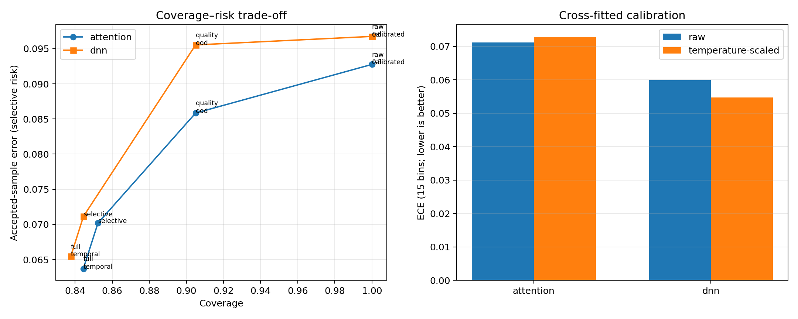

# WESAD Post-DNN Policy Reliability Experiment

Generated: `2026-09-10T16:43:22.704785Z`

## Protocol

- 15-subject WESAD leave-one-subject-out evaluation.
- Fixed `epoch_49` checkpoint for every DNN fold; the held-out subject is not used to select an epoch.
- For each outer subject, the other 14 subjects are deterministically split into 7 reference and 7 calibration subjects.
- Calibration uses only out-of-fold predictions from non-evaluation subjects.
- Original preprocessing provides chronological 20-second windows with a nominal 1-second step; alert rates use retained-window exposure.
- Main comparison: raw threshold → calibration → quality/OOD → selective prediction → full temporal policy.

## Attention DNN

Rows: `43457`; subjects: `15`.

| Method | Coverage | Accuracy* | Precision* | Recall* | F1* | Selective risk | False dispatches/alerts† |
|---|---:|---:|---:|---:|---:|---:|---:|
| raw_0.5 | 1.0000 | 0.9072 | 0.7546 | 0.8640 | 0.8056 | 0.0928 | 2716 |
| calibrated | 1.0000 | 0.9072 | 0.7546 | 0.8640 | 0.8056 | 0.0928 | 2716 |
| quality_ood | 0.9050 | 0.9142 | 0.7654 | 0.8678 | 0.8134 | 0.0858 | 2255 |
| selective | 0.8523 | 0.9298 | 0.8122 | 0.8806 | 0.8450 | 0.0702 | 1639 |
| full_temporal | 0.8444 | 0.9363 | 0.8358 | 0.8794 | 0.8570 | 0.0637 | 19 |

`*` Metrics after abstention are computed only on released RELIABLE samples; coverage must always be reported alongside them.

- Raw ECE: `0.0712`; calibrated ECE: `0.0728`.
- Full-policy coverage change: `-0.1556`.
- Full-policy accepted-risk change: `-0.0290`.
- Full-policy accepted-F1 change: `+0.0515`.
- Naive per-window false-dispatch reduction after temporal event coalescing: `99.30%`.
- Subject coverage min/median/max: `0.0003` / `0.9343` / `0.9945`.
- Subjects below 50% coverage: `S6`.
- Among subjects with at least 50% coverage, accepted risk improved for `14/14` and accepted F1 improved for `12/14`.

## Standard DNN

Rows: `43457`; subjects: `15`.

| Method | Coverage | Accuracy* | Precision* | Recall* | F1* | Selective risk | False dispatches/alerts† |
|---|---:|---:|---:|---:|---:|---:|---:|
| raw_0.5 | 1.0000 | 0.9033 | 0.7378 | 0.8767 | 0.8012 | 0.0967 | 3012 |
| calibrated | 1.0000 | 0.9033 | 0.7378 | 0.8767 | 0.8012 | 0.0967 | 3012 |
| quality_ood | 0.9050 | 0.9045 | 0.7348 | 0.8713 | 0.7973 | 0.0955 | 2666 |
| selective | 0.8445 | 0.9289 | 0.8144 | 0.8806 | 0.8462 | 0.0711 | 1637 |
| full_temporal | 0.8377 | 0.9345 | 0.8347 | 0.8796 | 0.8566 | 0.0655 | 22 |

`*` Metrics after abstention are computed only on released RELIABLE samples; coverage must always be reported alongside them.

- Raw ECE: `0.0599`; calibrated ECE: `0.0547`.
- Full-policy coverage change: `-0.1623`.
- Full-policy accepted-risk change: `-0.0313`.
- Full-policy accepted-F1 change: `+0.0553`.
- Naive per-window false-dispatch reduction after temporal event coalescing: `99.27%`.
- Subject coverage min/median/max: `0.0003` / `0.9023` / `0.9990`.
- Subjects below 50% coverage: `S6`.
- Among subjects with at least 50% coverage, accepted risk improved for `12/14` and accepted F1 improved for `10/14`.

## Controlled corruption audit

| Model | Non-finite | Extreme scale | Wrong feature order |
|---|---:|---:|---:|
| attention | 100.00% | 100.00% | 100.00% |
| dnn | 100.00% | 100.00% | 100.00% |

## Interpretation constraints

- The policy is a selective decision layer, so higher accepted-sample accuracy at lower coverage is not an all-sample accuracy improvement.
- † For pre-temporal methods, this column counts positive windows under a deliberately naive dispatch-on-every-window baseline. For the full policy it counts debounced notification events. The reduction therefore measures operational coalescing plus rejection, not a like-for-like classifier false-positive reduction.
- Subject-level heterogeneity is material: a subject rejected almost entirely by the OOD gate demonstrates safe abstention but also poor usability, and must not be hidden by pooled metrics.
- Window timestamps were unavailable in the processed JSON; retained chronological rows were treated as one-second steps for alert-rate normalization.
- Raw-signal quality metrics cannot be reconstructed from the 12-feature JSON and were therefore not evaluated here.
- Results apply to the frozen LOSO epoch-49 checkpoints and the documented thresholds; threshold tuning on evaluation subjects was not performed.
